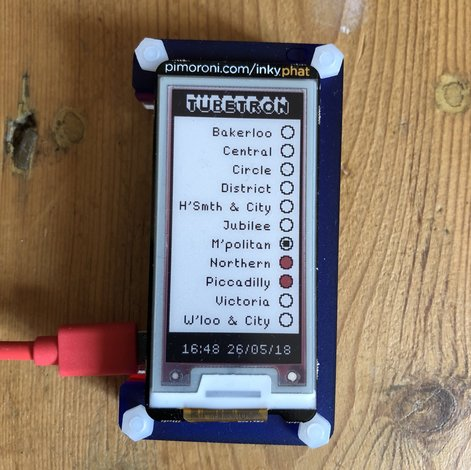

# tubetron

## An eink London Underground status display, using Pimoroni's inkyphat and a Raspberry Pi.

The status of a transport network such as the Underground in London changes periodically over the course of the day. This relatively infrequent change of status means that a low-power screen is a good choice to display the information. This project uses [Pimoroni's inkyphat](https://shop.pimoroni.com/products/inky-phat), an eink screen specifically designed for raspberry pi's 40 pin header. Usefully, it comes with a [python SDK](https://github.com/pimoroni/inky-phat) based on PIL. 

Tubetron displays a visualisation of the TfL tube status data. A white circle means that the service is 10/10, a black dot means 9/10, a black dot on red means 8/10, and a red circle means 7/10 or below. 

## Installation

1. SSH into your raspberry pi

2. [Install pipenv](https://docs.pipenv.org/), if you haven't already.

3. Clone the repo:

`git clone https://github.com/johnmildinhall/tubestatus.git`

3. `cd tubestatus`

4. Install all the dependencies

`pipenv install`

5. `pipenv run python tube.py`

## To Dos

* Fix Daylight Saving Time issues - at the moment it is manually set to BST.
* Update upon change of status only
* Locally update Last Update timestamp at bottom, independently of the rest of the screen.

